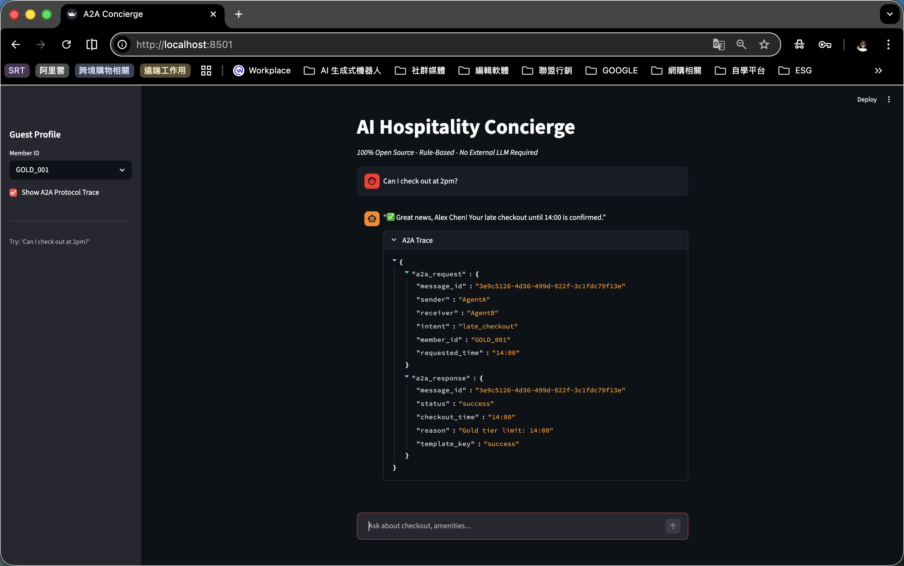

# A2A Hospitality Concierge (Simple)

> 100% Open Source - Rule-Based - No LLM/Vector DB - Portfolio Demo

## 🌐 Live Demo
**https://a2a-hospitality-simple.onrender.com**

> ⚠️ 免費層級有休眠機制，首次訪問需等待 30-50 秒喚醒，屬正常現象。

## Demo Screenshot

## Quick Start
1. docker compose up --build -d
2. open http://localhost:8501

## Architecture
Streamlit UI -> Agent A (Intent Parser) -> A2A JSON -> Agent B (Rule Engine + Policy Dict) -> Response

## Test Cases
| Member | Prompt | Result |
|--------|--------|--------|
| GOLD_001 | Can I check out at 2pm? | Approved |
| SILVER_002 | Can I check out at 2pm? | Needs approval |
| NEW_GUEST | Can I check out at 2pm? | Denied |

## Tech Stack
- Backend: FastAPI + Pydantic
- Frontend: Streamlit
- Infra: Docker Compose
- Logic: File-based Policy RAG Simulation
- License: MIT
